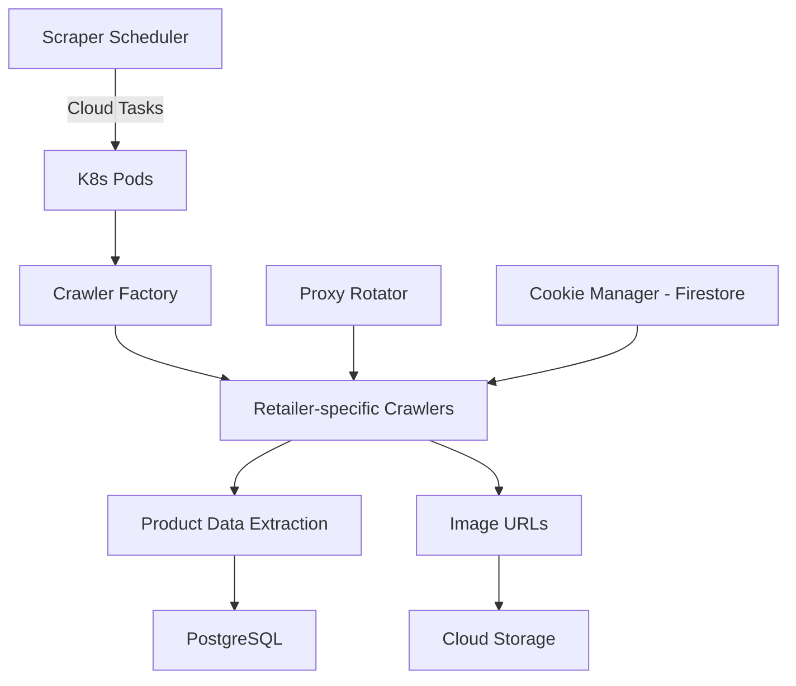

# shelf-analytics-scraper

Production web crawlers for monitoring product pages across 10+ retail websites. Built with Playwright and Crawlee, deployed on Kubernetes.

Part of the [Loupe](https://getloupe.com) shelf analytics platform.

## Architecture

## What it does

Each crawler is built as a retailer-specific implementation that handles the unique DOM structure, anti-bot measures, and data formats of that retailer. The system:

- Navigates product pages using Playwright (headless Chromium)
- Extracts structured product data: price, availability, images, specifications, variants
- Handles anti-bot detection with proxy rotation, cookie persistence, and browser fingerprint management
- Publishes extracted data to PostgreSQL and images to Cloud Storage
- Runs on Kubernetes with horizontal pod autoscaling

## Key technical decisions

- **Crawlee framework** for request queue management, automatic retries, and session rotation
- **Retailer-specific crawlers** rather than a generic scraper -- each site has enough unique behavior to warrant dedicated extraction logic
- **HAR-based testing** -- recorded HTTP archives allow offline testing of extraction logic against real page structures
- **Proxy rotation via Firestore** -- active proxy IPs are stored in Firestore with health status, enabling dynamic rotation without redeployment
- **Anti-bot handling** per retailer -- some need residential proxies, others need cookie warming, others need specific request timing

## Stack

TypeScript, Playwright, Crawlee, Kubernetes, Cloud Tasks, Firestore, PostgreSQL, Cloud Storage, Docker
